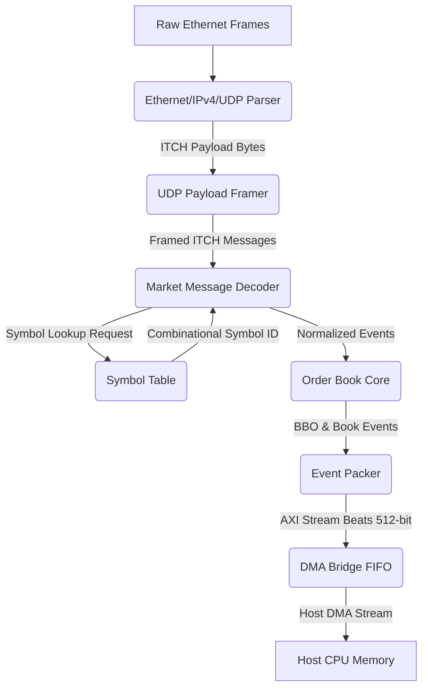

# FPGA Market Data & Order Book Pipeline

An ultra-low latency, hardware-accelerated market data processing pipeline implemented in SystemVerilog. The architecture parses raw Ethernet frames containing UDP-encapsulated Nasdaq ITCH 5.0 feeds, decodes order book events, tracks individual order/price level states, recomputes Best Bid/Offer (BBO) combinationally, and streams formatted event records to a host-facing DMA interface.

---

## 1. System Architecture

The pipeline uses a modular, streaming architecture where data flows sequentially from the network physical layer interface (MAC/PHY) to host system memory.



### Overall Pipeline Stages

1. **Parser Stage**: Parses Ethernet header (MAC addresses, EtherType), extracts the IPv4 header (validating IP protocol `17` for UDP, total packet length, and computing/validating the IPv4 header checksum), and filters out non-UDP or malformed traffic.
2. **Framer Stage**: Handles UDP payload boundaries and implements a skid buffer to handle downstream backpressure without dropping ITCH message boundaries.
3. **Decoder Stage**: Decodes Nasdaq ITCH 5.0 protocols from big-endian binary byte streams into normalized event structures. Simultaneously interacts combinationally with the Symbol Table.
4. **Order Book Stage**: Tracks order state (using 4-way set associative order hash memory) and aggregate price level quantities. It maintains an active cache of the top 8 price levels per symbol side to calculate BBO instantly when liquidity is modified or deleted.
5. **Packer & Stream Stage**: Merges the local high-resolution hardware timestamp with book event data into 512-bit wide AXI4-Stream words, which are queued into the DMA Bridge's synchronous buffer.

---

## 2. Module Specifications

### 2.1 Ethernet/IPv4/UDP Parser (`eth_ipv4_udp_parser.sv`)
- **Function**: Processes incoming byte-wide data from the MAC layer on a streaming interface.
- **Protocol Checking**:
  - Validates EtherType is `08 00` (IPv4).
  - Validates IPv4 header version (`4`) and protocol ID (`17` for UDP).
  - Extracts total length and compares it with payload bounds.
  - **IP Checksum Verification**: Implements a synthesizable 20-byte RFC 791 internet checksum validation routine, asserting an invalid IP flag (`err_invalid_ip`) if mismatch is found.

### 2.2 UDP Payload Framer (`udp_payload_framer.sv`)
- **Function**: Extracts the raw UDP payload stream and slices it into framed message packets.
- **Skid Buffer**: Implements an explicit `case({accept, drain})` flow control system. This manages handshakes on both input and output ports concurrently, ensuring no beats are lost during transitions from backpressure to drain.

### 2.3 Market Message Decoder (`market_message_decoder.sv`)
- **Function**: Decodes Nasdaq ITCH 5.0 message formats.
- **Supported Messages**:
  - `R`: Stock Directory (registers mapping from string ticker to a numeric symbol ID).
  - `A` / `F`: Add Order (adds a new limit order to the book).
  - `E` / `C` / `D` / `U`: Order Executed, Cancelled, Deleted, or Replaced.
  - `P`: Trade (non-book trade event).
- **Symbol Table Interface**: Connects combinationally to `symbol_table.sv` during state `s2` to query the registered symbol ID, allowing it to latch the mapped ID in the same cycle it moves to the event dispatch stage (`s3`).

### 2.4 Symbol Table (`symbol_table.sv`)
- **Function**: Maintains a high-speed memory mapping from Stock Locates (ticker indexes) to internal dense Symbol IDs.
- **Timing**: Features combinational lookup paths so that when the decoder places a Stock Locate request on the port, the mapped Symbol ID is returned in the same clock cycle.

### 2.5 Order Book Core (`order_book_core.sv`)
- **Function**: The stateful execution core.
- **Associative Memory Hashing**:
  - Implements 4-way set-associative arrays for both `order_mem` and `level_mem`.
  - Performs full tag key checks (`order_id` for orders, and `{symbol_id, side, price}` for levels) to handle hash collisions securely and prevent silent database stomp corruption.
- **Active Level Tracking Cache**:
  - Tracks the top `N_TRACKED = 8` price levels for each symbol and side.
  - On liquidity adjustments, replacements, or deletions, BBO recalculation runs combinationally across only these 8 tracked levels.
  - Provides BBO updates (`best_bid`, `best_ask`, `best_bid_qty`, `best_ask_qty`) in the same clock cycle as the update.

### 2.6 Event Packer (`event_packer.sv`)
- **Function**: Slices and formats outgoing book events into host-aligned words.
- **Bus Sizing**: Features a 512-bit wide AXI4-Stream data bus (`BEAT_W = 512`).
- **Timestamping**: Embeds the local hardware timestamp `ts_local_ctr` in non-overlapping bit slices (`[REC_W+64-1:REC_W]`) alongside the book event record.

### 2.7 DMA Bridge (`dma_bridge.sv`)
- **Function**: Acts as the physical-to-virtual memory buffer.
- **FIFO Buffer**: Implements a synchronous FIFO with status outputs (`fifo_occupancy`, `fifo_overflow`) and performance statistics registers (`cnt_beats_in`, `cnt_beats_out`, `cnt_overflow_drops`).

---

## 3. Simulation & Verification

The project includes a comprehensive verification environment using Verilator timing-enabled simulation.

### 3.1 Directory Layout
```
tb/
├── int/
│   └── tb_int_pipeline.sv            # Full-path system integration testbench
├── unit/
│   ├── tb_decoder.sv                 # Decoder unit tests
│   ├── tb_dma_bridge.sv              # DMA FIFO flow control/overflow tests
│   ├── tb_eth_ipv4_udp_parser.sv     # IP parsing/checksum validation tests
│   ├── tb_event_packer.sv            # Event word formatting and timestamp tests
│   ├── tb_order_book.sv              # Order book state machine lifecycle tests
│   └── tb_udp_payload_framer.sv      # Flow control skid-buffer tests
└── vectors/
    ├── itch_vectors.svh              # Test vectors for ITCH messages
    └── itch_vectors_seq.svh          # Sequence generators for simulation
```

### 3.2 Compilation & Execution Commands

A `Makefile` is provided in the repository root to automate the Verilator build and run steps.

#### Running Unit Tests
To run a specific unit testbench, provide its name to the `TB` variable:
```bash
# Verify the Market Message Decoder
make sim TB=tb_decoder

# Verify the Order Book Core & BBO calculation
make sim TB=tb_order_book

# Verify the Ethernet/IP/UDP parser
make sim TB=tb_eth_ipv4_udp_parser

# Verify the UDP payload framer
make sim TB=tb_udp_payload_framer

# Verify the Event Packer
make sim TB=tb_event_packer

# Verify the Host DMA Bridge
make sim TB=tb_dma_bridge
```

#### Running the Integration Test
To run the full end-to-end integration test (which injects raw Ethernet frames and verifies DMA outputs):
```bash
make sim_int
```

#### Cleaning Up Builds
To clean the compiled object files and binaries:
```bash
make clean
```
