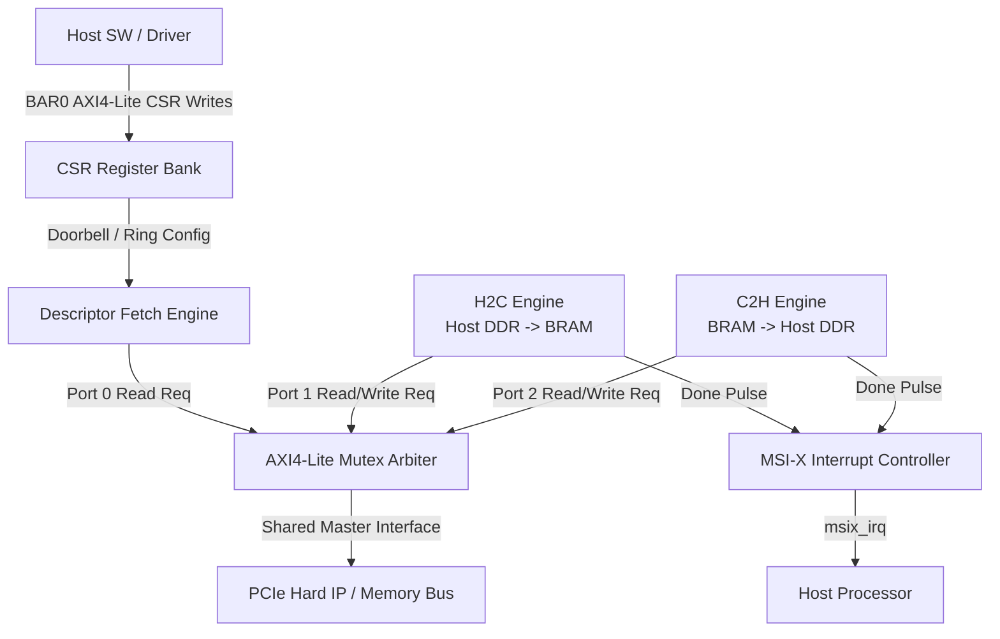

# 🚀 PCIe Scatter-Gather DMA Engine (AXI4-Lite)

An open-source, high-performance, synthesizable **SystemVerilog Scatter-Gather DMA Engine** designed for PCIe Hard IP endpoints exposing **AXI4-Lite** interfaces. It features a hardware ring-buffer descriptor fetcher, Host-to-Card (H2C) and Card-to-Host (C2H) data movement engines, an AXI4-Lite mutex arbiter, and MSI-X interrupt delivery.

---

## 📐 Block Diagram & Architecture



---

## ✨ Key Features

- **AXI4-Lite Interface Compliance**: Designed specifically for FPGA PCIe IP cores lacking full AXI4 MM burst managers.
- **Mutex Arbiter (`axi4_arbiter.sv`)**: Round-robin lockless arbitration across descriptor fetch, H2C, and C2H engines with zero multi-beat transaction interleaving.
- **Hardware Ring Buffer**: Software posts descriptors to Host DDR and updates `TAIL_PTR` (doorbell); hardware automatically increments `HEAD_PTR` upon completion.
- **Dual Memory Model**: Disambiguates Host DDR (`0x0000_0000`) and local on-chip BRAM (`0x8000_0000`).
- **MSI-X Interrupts**: Fires interrupt pulses on transfer completion with descriptor counters.

---

## 📑 BAR0 CSR Register Map

| Offset | Register | Access | Description |
|---|---|---|---|
| `0x000` | `ADDR_CTRL` | R/W | Bit 0: `dma_enable` |
| `0x004` | `ADDR_RING_BASE` | R/W | 32-bit Host DDR Ring Base Address |
| `0x00C` | `ADDR_RING_SIZE` | R/W | Ring Size (up to 1024 slots) |
| `0x010` | `ADDR_TAIL_PTR` | R/W | Doorbell register (SW-owned tail index) |
| `0x014` | `ADDR_HEAD_PTR` | RO | Hardware progress pointer (head index) |
| `0x018` | `ADDR_IRQ_EN` | R/W | Bit 0: MSI-X Interrupt Enable |
| `0x01C` | `ADDR_STATUS` | RO | Bit 0: `dma_done`, Bit 1: `dma_error` |
| `0x020` | `ADDR_DESC_CNT` | RO | Total completed descriptor counter |

---

## 📝 Descriptor Layout (16 Bytes)

| Offset | Field | Description |
|---|---|---|
| `+0x00` | `src_addr` | 32-bit Source Address (Host DDR or Local BRAM) |
| `+0x04` | `dst_addr` | 32-bit Destination Address (Local BRAM or Host DDR) |
| `+0x08` | `length` | Transfer length in bytes |
| `+0x0C` | `control` | Bit 1: `IRQ_EN`, Bit 3: `DIR` (`0` = H2C, `1` = C2H) |

---

## 🧪 Simulation Results (Verilator 5.020)

The RTL design and testbenches (`dma_top_tb.sv`, `axi4_mem_bfm.sv`, `tb_verilator.cpp`) were verified using **Verilator**.

### Test Execution Summary
- **Test Case**: H2C single-descriptor 256-byte transfer from Host DDR (`0x0000_2000`) to Local BRAM (`0x8000_0000`).
- **Data Integrity**: **PASSED** (100% byte-by-byte match `dst_byte === src_byte`).
- **Interrupt Verification**: **PASSED** (`msix_irq` pulse received at $2.45\,\mu\text{s}$).

```text
[TB] MSI-X interrupt observed at time 2450000 ps
[TB] H2C DDR->BRAM single-descriptor smoke test PASSED (head_ptr should now equal tail_ptr=1)
- rtl/dma_top_tb.sv:126: Verilog $finish
```

---

## 🚀 How to Run Simulation

### 1. Run via Verilator (SystemVerilog Testbench)
```bash
make -f Makefile.verilator
```

### 2. Run C++ Verilator Testbench
```bash
verilator --cc --exe --trace -Wall -Wno-fatal -Irtl \
  rtl/dma_pkg.sv rtl/dma_top.sv rtl/axi_lite_csr.sv \
  rtl/desc_fetch_engine.sv rtl/h2c_engine.sv rtl/c2h_engine.sv \
  rtl/axi4_arbiter.sv rtl/irq_ctrl.sv \
  tb/tb_verilator.cpp --top-module dma_top

make -C obj_dir -f Vdma_top.mk Vdma_top
./obj_dir/Vdma_top
```

---

## 📂 Repository File Structure

```text
pcie-sg-dma-engine/
├── rtl/
│   ├── dma_pkg.sv           # Package types, parameters, and ring math
│   ├── dma_top.sv           # Top-level integration & interconnects
│   ├── axi_lite_csr.sv      # BAR0 register map
│   ├── desc_fetch_engine.sv # 16B descriptor fetcher state machine
│   ├── h2c_engine.sv        # Host-to-Card transfer engine
│   ├── c2h_engine.sv        # Card-to-Host transfer engine
│   ├── axi4_arbiter.sv      # AXI4-Lite mutex arbiter
│   └── irq_ctrl.sv          # MSI-X interrupt controller
├── tb/
│   ├── dma_top_tb.sv        # SystemVerilog testbench suite
│   ├── axi4_mem_bfm.sv      # Dual-memory (DDR/BRAM) AXI-Lite slave model
│   └── tb_verilator.cpp     # C++ Verilator testbench harness
├── Makefile.verilator       # Build and execution Makefile
└── README.md                # Documentation & simulation report
```
